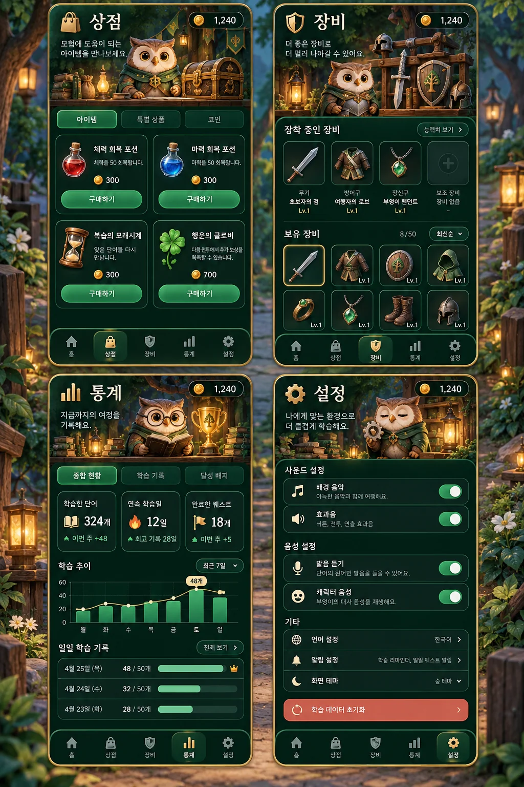
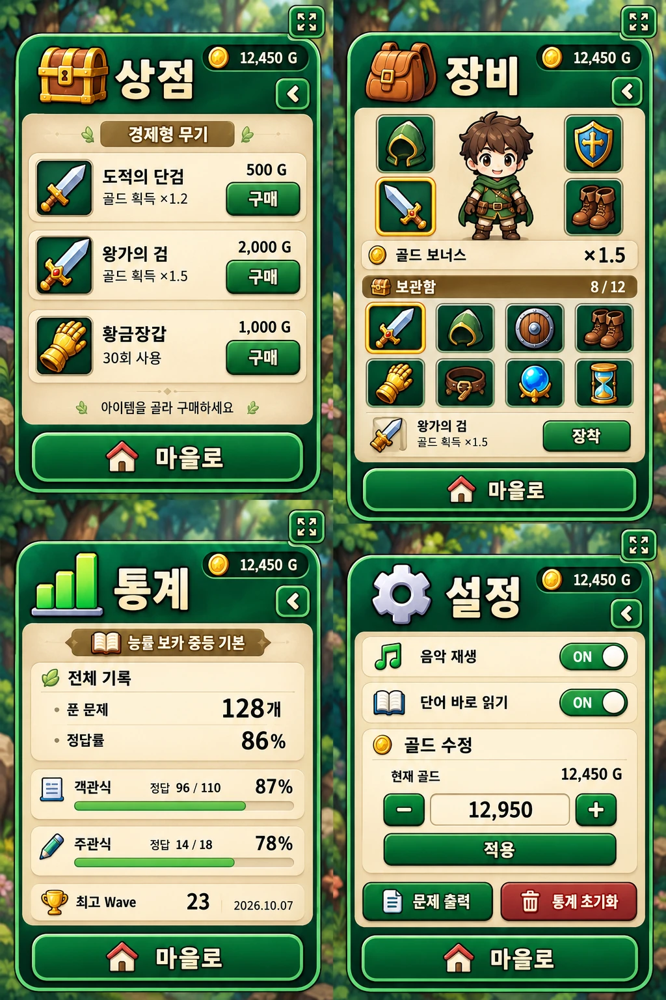

> 과거 작업 기록입니다. 현재 구현은 [현행 사양](../spec.md), 재개 절차는 [작업 인계](../handoff.md)를 확인하세요.

# 생성 이미지 디자인

2026-10-06, 내장 `image_gen`으로 전체 모바일 로비 UI 시안을 만들고, 그 시안을 참조해 실제 에셋을 생성했다.
숲속 모험가 길드, 나무·양피지·비취 버튼으로 기존 어두운 메뉴의 디자인을 교체했다.
보이는 타이틀도 생성 그림이다. 단어·설명·가격처럼 바뀌는 내용은 HTML 텍스트와 실제 컨트롤로 표시한다.

## 현재 저장과 적용

배포 파일은 `images/theme/`, 테마는 `styles/fantasy-theme.css`다.
전체 디자인 시안은 [guild-lobby-concept.webp](../design/guild-lobby-concept.webp)로 저장했고 배포 빌드에는 포함하지 않는다.
PNG 생성 원본은 도구 출력 디렉터리에 보존했다. Pillow는 비율 유지 축소와 WebP 변환에만 사용했다.
신규 에셋은 quality 88, method 6이며 로고·아이콘의 실제 알파 채널을 유지했다.
배포용 생성 에셋은 총 8개, 1,562,524 bytes다.

| 파일               | 크기           |  bytes | 적용                                       |
| ------------------ | -------------- | -----: | ------------------------------------------ |
| guild-lobby.webp   | 900×1599       | 303120 | 메인 전체 배경                             |
| guild-titles.webp  | 1774×887, RGBA | 287158 | 여섯 이름의 생성 로고, 2×3 atlas           |
| guild-panel.webp   | 768×768        |  31852 | 나무·양피지 버튼, 메뉴 창, 결과, 상세 패널 |
| guild-jade.webp    | 768×768        |  36694 | 연습·시작·닫기·구매·설정 버튼              |
| guild-emblems.webp | 1024×512, RGBA | 120672 | 길드 스타일의 4×2 메뉴 아이콘              |
| library.webp       | 1200×800       | 257530 | 연습 배경                                  |
| courtyard.webp     | 1200×800       | 265076 | 배틀 배경                                  |
| dragon-tower.webp  | 1200×800       | 260422 | 전체 단어 도전 배경                        |

나무/양피지·비취 패널은 `border-image: ... 16% fill`로 9-slice 적용한다.
모서리를 고정한 채 가장자리와 내부만 늘려 서로 다른 크기의 버튼·창에 같은 생성 디자인을 사용한다.
메인, 학습 선택, 이야기, 상점, 장비, 통계, 설정, 확인, 결과 창에 적용한다.
학습 단어와 정답 영역은 읽기 쉬운 단순한 종이색 카드로 유지한다.

`킹왕짱·왕짱킹·킹짱왕·왕킹짱·짱킹왕·짱왕킹` 여섯 로고와 접근성 h1, document.title은 함께 바뀐다.
시작·학습에서 제목으로 돌아올 때 직전 이름을 제외해 고르고, 메뉴를 여닫을 때는 유지한다.
atlas 선택은 장식용 CSS 배경 위치에만 사용한다. 실제 조작은 native button, Grid/Flex, native dialog/top layer다.
이전 academy/mobile-emblems 파일은 참조가 없어 제거했다. 기존 생성 PNG와 프롬프트는 보존했다.

## 현재 생성 프롬프트

내장 도구 모드만 사용했다. 11·15는 `transparent_background: true`, 나머지는 false다.
10은 전체 디자인 시안, 11~15는 모두 10의 생성 PNG를 스타일 참조로 제공했다.

### 10. 전체 로비 UI 시안 (../design/guild-lobby-concept.webp)

Create ONE finished mobile vocabulary RPG lobby UI design concept, portrait 9:16. This is an entire cohesive illustrated game interface, not just a background. New art direction: cozy adventurer's guild in a lush emerald forest, warm carved walnut wood, cream parchment, jade-green enamel, softly shaded chunky hand-painted 3D cartoon mobile game art. A charming distant treehouse academy, morning sunlight, a small winding path; the scenery occupies upper-middle background and stays quiet behind controls. Strong readable silhouettes, clean substantial borders, no elaborate filigree, no spark showers, no noisy microdetail. At top a small coin status pill left and vocabulary-book selector right. Below a LARGE splendid sculpted illustrated Korean game logo reading exactly "킹왕짱" with smaller "RPG" below, thick golden cream lettering, deep teal outline, little crown and open book integrated into logo. The logo must feel like designed game art. In middle-lower area one large wide embossed jade-and-wood button with open-book icon on left and readable Korean "연습 모드", smaller subtitle "뜻과 발음 익히기". Below this two equal wide illustrated cream parchment inset tiles in wooden frames: crossed-swords icon and "배틀 모드" on left, friendly blue dragon and "전체 단어 도전" on right. Bottom a dedicated carved wood dock with FOUR evenly spaced compact inset illustrated square buttons, treasure chest "상점", shield "장비", trophy "통계", gear "설정". Entire control layout within safe mobile edges. Professional polished mobile game menu with generously readable typography, beautiful tactile illustrated controls, modern touch friendly spacing, no ornamental clutter. Top logo takes about 20% of height, art scene around 25%, controls bottom 45%. No phone hardware, no watermark. Deliver ONE full-screen concept.

### 11. guild-titles.webp

Production asset: ONE transparent title-logo atlas for the mobile game shown in the reference. Match its cozy walnut wood, deep jade enamel, cream-gold chunky sculpted cartoon letters, tiny crown and open book, clean premium mobile RPG art. Canvas wide 2:1 aspect ratio. STRICT grid TWO columns by THREE rows, SIX equal rectangular cells, each cell 3:1 aspect ratio. Each logo centered fully inside its cell with transparent padding and equal size. Six complete separate logos. Exact text in reading order: row 1 left "킹왕짱", row 1 right "왕짱킹"; row 2 left "킹짱왕", row 2 right "왕킹짱"; row 3 left "짱킹왕", row 3 right "짱왕킹". Each logo has ONLY its exact three Korean syllables on one large line, and smaller "RPG" centered below. Do not change, add or repeat any syllable. All three characters legible, same bold size. Every logo includes a small integrated crown above and open book below, restrained leaves at sides. Horizontally spread the title to occupy 82% of its cell width and 82% height. No background scene, no buttons, no other text, no labels, no numbered cells, no watermark. Real transparent alpha across canvas and gaps. The artwork must NOT cross a cell boundary. All six retain exactly same overall design and typography; only character order differs.

### 12. guild-lobby.webp

Production background for the reference mobile RPG lobby. Retain the exact cozy emerald forest adventurer guild art direction, warm chunky hand-painted cartoon wood, lush foliage, morning sunlight, treehouse academy beside small waterfalls in distance, friendly tiny owl sitting on lower-left railing. Portrait 9:16 full bleed. REMOVE ALL interface elements, words, logos, numbers, title letters, plaques, menu buttons, coin counter, selector, bottom dock. This must be ONLY an environmental background. Upper 25% quiet leafy sky with soft pale blue and distant green silhouettes behind the separately composited title logo. Middle 35% the scenic treehouse academy and winding forest path, crisp welcoming architecture. Bottom 40% calm softly shaded wooden platform and subdued distant foliage for separately overlaid game controls; no foreground objects in this bottom area. Avoid microdetail, hard high-contrast distractions, glitter, particles. Rich but controlled saturation, strong light separation. Nothing resembling letters anywhere, no watermark.

### 13. guild-panel.webp

Production reusable UI skin derived from the reference mobile fantasy guild game. ONE square 1:1 front-facing orthographic panel. A substantial beautifully hand-painted warm walnut wood frame with thick softly rounded corners, subtle carved bevels, four SMALL gold rivets, tiny clean gold corner caps. Interior is very light warm cream parchment, nearly uniform with only subtle smooth paper texture, NO stains or mottling. Match reference cozy premium chunky 3D cartoon mobile RPG art. This asset must support nine-slice scaling: ALL wooden and gold frame artwork strictly confined within outermost 12 percent on EACH edge; central 76 percent width and height absolutely calm light cream paper, no ornament or subject anywhere there. Symmetric corners, continuous straight wood edges with consistent thickness. Panel fills entire square canvas edge to edge, no perspective, no exterior margins, no transparent background, no drop shadow outside edges, no text, icons, symbols, buttons, watermark. Not a screenshot; just one production frame-and-paper texture usable for buttons AND menus.

### 14. guild-jade.webp

Production reusable UI skin matching reference cozy woodland guild mobile RPG. ONE square 1:1 front-facing orthographic JADE BUTTON PANEL, same substantial warm walnut wood frame, thick softly rounded corners, small restrained gold corner caps and rivets. Interior smooth richly shaded deep emerald jade enamel, bright softly lit top edge, broad simple bevel giving tactile pressable appearance. No central decoration at all. Designed for nine-slice scaling: ALL outer wooden/gold frame artwork strictly confined within outermost 12 percent on each edge; central 76 percent both directions quiet uniform dark jade enamel. No icons, subjects, text, words, labels, symbols, watermark. Symmetric corners, straight continuous edge strips. Image fills canvas edge to edge, no margins, no scene, no perspective. Same chunky painted polished mobile-game quality as reference. One button surface asset only, not a screenshot.

### 15. guild-emblems.webp

ONE production menu icon atlas for the reference cozy woodland guild mobile RPG. Wide 2:1 canvas, STRICT FOUR columns by TWO rows, eight exactly equal square cells, true transparent background and gaps. Reading order: open cream parchment book with green leaf emblem; two crossed silver swords with warm wooden handles; friendly small round blue baby dragon; open walnut treasure chest with gold coins; jade-green shield with gold rim and leaf insignia; simple gold trophy; simple silver cog gear; quill with cream parchment. Each object centered and contains itself inside inner 72 percent of its cell, consistent scale, no overlap. Match the reference chunky softly shaded hand-painted 3D cartoon mobile game assets, warm walnut/cream/emerald palette with a dark strong contour. Readable at 40px. Broad simple shading, clean silhouettes, no sparkling wisps, no glow, no filigree, no tiny carvings, no scenery, no plaques, no buttons, NO text or labels, no watermark. Only the eight isolated icons in the prescribed equal-cell grid, actual alpha background.

## 실제 플레이 화면 통일

연습·배틀·전체 단어 도전의 플레이 화면은 `styles/guild-gameplay.css`에서 로비와 같은 나무 프레임,
양피지 읽기 영역, 비취 실행 버튼을 공유한다. 상단 길드 헤더에 음악과 나가기를 배치해 캐릭터를 가리지 않는다.
연습은 로비 숲 풍경을 이어 쓰고, 배틀과 전체 단어 도전은 새로 생성한 밝은 길드 훈련장을 사용한다.
객관식은 번호가 있는 2×2 답안 카드다. 정답은 비취색과 체크 표시, 오답은 붉은색과 × 표시로 구분한다.
주관식 입력, 힌트, 스킬, 암기 필터와 이전/다음 버튼도 같은 재질을 사용한다. 작은 화면에서는 본문을 스크롤하고
연습 하단 조작은 고정한다. 가로 회전 시에는 풍경과 플레이 본문을 좌우로 배치하고, 키보드 높이 변화에는 게임 높이를 유지한다. 키보드 포커스 표시와 reduced-motion 설정을 유지한다.

추가 에셋: `images/theme/guild-courtyard.webp` (1200×800, WebP quality 88, method 6).
내장 image_gen으로 기존 `guild-lobby.webp`를 스타일 참조해 생성했으며 PNG 원본은 `/workspace/generated_images/`에 보존했다.
크기 축소와 WebP 변환만 Pillow로 수행했다.

### 16. guild-courtyard.webp

Create ONE new production environment illustration, landscape 3:2, for the ACTUAL BATTLE SCREEN of the vocabulary RPG in the reference. Match precisely the reference's sunny cozy forest guild style: chunky softly shaded hand-painted 3D cartoon game art, warm walnut beams, jade banners, cream stone, lush emerald forest, cheerful golden daylight. A forest adventurer guild TRAINING COURTYARD, broad empty flat warm wood practice platform across lower 40%, wooden railing and cream stone arches around distant edges, jade-roofed treehouse guild behind, leafy trees and small waterfall in distance. Symmetrical balanced arena composition, left and right lower platform empty so separate hero/monster sprites can stand there. Middle platform empty. Upper portion quiet scenery behind separately rendered HUD. No people, no characters, no dragon, NO UI, NO buttons, no borders, no text, no words, no numbers, no logos, no watermark. Not a screenshot. Entire environment artwork only. Bright welcoming palette like reference, avoid old midnight-blue academy aesthetic. Clean broad shapes, controlled background detail, premium polished mobile game quality.

## 캐주얼 모바일 게임 UI

이전 나무·양피지 프레임을 플레이와 메뉴에서 제거하고, 흰색과 민트색의 둥근 HUD, 입체 액션 버튼,
파랑·보라·노랑·민트 답안 타일로 교체했다. 로비 버튼과 메뉴도 같은 조형을 공유한다.
전장에는 액자 없이 모험가와 몬스터가 직접 서고, 움직임 줄이기 설정을 따르는 작은 대기 동작과 기존 공격 동작을 사용한다.
연습은 큰 단어 카드와 뜻 확인 카드, 아래 고정 필터와 기억하기 버튼으로 구성한다.
보스·주관식 입력과 정답·오답 상태, 작은 화면 스크롤, 가로 회전 레이아웃과 기존 저장 데이터는 유지한다.

추가 에셋: `images/theme/quest-characters.webp` (1024×1024, RGBA, WebP quality 88, method 6).
2×2 투명 atlas의 순서는 모험가·슬라임·박쥐·아기 용이며, CSS 배경 위치로 표시한다.
기존 이미지 요소는 엔진의 몬스터 종류 선택과 애니메이션 상태를 보존하고 시각 표현은 새 atlas를 사용한다.
PNG 생성 원본은 `/workspace/generated_images/`에 보존했으며 크기 축소와 WebP 인코딩만 Pillow로 수행했다.

### 17. quest-characters.webp

Create ONE production TRANSPARENT character sprite atlas for a fresh contemporary mobile vocabulary battle game. 1:1 square image. STRICT TWO columns by TWO rows, FOUR equal square cells. Each cell contains exactly ONE full-body small chibi 3D cartoon game character, centered, character fits inside central 78 percent of its cell with equal padding and zero overlap across cells. Consistent eye-level camera, feet baseline, cheerful polished toy-like sculpted style, rounded broad silhouettes, simple clean shapes, soft glossy shading, readable tiny size, strong color separation. Cell row1 col1: brave young forest explorer girl, dark short hair, mint green hoodie-cape, cream outfit, orange scarf, small short wooden training sword, facing three-quarter RIGHT. Cell row1 col2: friendly squishy aqua-blue slime monster with big expressive dark eyes, tiny crown-shaped leaf, facing three-quarter LEFT. Cell row2 col1: small playful lavender bat monster with tiny wings and round body, facing three-quarter LEFT. Cell row2 col2: adorable coral-orange baby dragon with cream belly, tiny teal horns, facing three-quarter LEFT. No aggression, no scary teeth. The four are designed as premium casual RPG mascots like modern family-friendly mobile games. NO frames, NO cards, NO scenery, NO backplates, NO cell grid lines, NO UI, NO words, NO logos, NO effects, no weapons crossing grid boundaries, no ground disk. True alpha transparent background across all empty area. Whole characters, no crop. Only the four separate isolated character sprites on a 2x2 atlas.

### 메타 정보와 버튼 여백 정리

골드·진행 정보·타이머는 두 줄 Grid로 정렬하고, 금액에는 tabular-nums와 명시적인 아이콘/단위 간격을 적용한다.
음악명은 흐르는 빈 텍스트 대신 즉시 읽을 수 있는 한 줄 말줄임으로 표시하며 선택 컨트롤은 유지한다.
버튼과 카드의 단차를 2px로 줄이고, 민트와 빨강 실행 버튼은 얕은 그림자·윗면 하이라이트를 공유한다.
설정 버튼은 48px 이상으로 같은 폭에 정렬한다. 통계/결과의 라벨과 값은 묶어서 줄바꿈하며,
금액 수정의 화살표와 숫자 영역은 Grid로 배치한다. 320×568, 375×667, 390×844, 844×390에서
16자리 골드, 긴 음악/학습 범위와 결과 수치를 넣어 겹침과 가로 잘림을 확인했다.

## 배틀 중심 시작 화면과 길드 내부 메뉴

생성한 시작 화면의 에메랄드·크림·골드 색과 얕은 버튼 단차를 구현했다.
배틀을 첫 번째 큰 버튼으로 배치하고 차분한 붉은색으로 강조한다. 연습은 아래 민트색 버튼으로 이동했다.
숲 마을·석양 훈련장·달빛 정원 배경은 시작하거나 플레이에서 마을로 돌아올 때 타이틀과 함께 랜덤으로 선택하며,
직전 배경을 연속으로 선택하지 않는다. 상점 같은 내부 메뉴를 열고 닫을 때는 배경을 유지한다.

내부 메뉴의 생성 시안은 아래와 같다. 색, 삽화 헤더, 카드와 스위치 조형을 실제 기능과 데이터에 맞춰 구현했다.

배경 원본은 3열 atlas `exec-1c11c0cd-12b4-43f3-8247-a5e59e2ef861.png`,
메뉴 시안은 `exec-5d086ef3-6984-47d0-b104-14e00c090804.png`,
내부 삽화는 2×2 atlas `exec-c5dff401-fc9d-4a64-945f-f411a1667699.png`이며 `/workspace/generated_images/`에 보관한다.
Atlas에서 각 셀을 추출하고 WebP로 인코딩했다. 배경은 quality 88,
메뉴 삽화는 quality 87, 시안 문서 이미지는 quality 85이며 모두 method 6을 사용한다.
배경 3장과 메뉴 삽화 4장의 런타임 에셋 크기는 합계 약 820KB다.
가격·통계·설정 및 모든 클릭 영역은 HTML로 렌더링한다.

## 첨부 메뉴 스타일 적용과 세로 화면 정리

최신 참고 이미지에 맞춰 연습 모드를 큰 첫 번째 버튼으로, 배틀과 전체 단어 도전을 두 번째 줄로 배치했다.
상점·장비·통계·설정은 아이콘을 위에 두는 네 개의 버튼이다. 배틀은 차분한 적갈색을 유지한다.
새로 생성한 `quest-menu-skin.webp`를 nine-slice로 실제 버튼과 게임 학습 패널에 사용한다.
버튼 라벨·통계·문제·정답은 읽기와 접근성을 위해 HTML 텍스트로 유지한다.
게임·결과·범위 선택·확인 화면도 숲 초록과 크림 글자색으로 맞췄다.

게임 프레임의 가로:세로 최대 비율은 3:4다. 가로 화면에서도 세로 프레임을 가운데 배치하며
각 팝업 폭은 프레임을 넘지 않는다. 긴 오답은 줄바꿈하고 본문을 스크롤해 하단 버튼을 유지한다.
전체화면 버튼은 하나만 렌더링하고 우상단 12px(안전 영역 포함)에 고정한다.
네이티브 dialog가 열리면 버튼을 해당 top layer로 옮겨 항상 접근할 수 있게 한다.
지원하지 않는 브라우저에서도 같은 위치에 표시하며 누르면 지원 여부를 안내한다.

숲·석양·달빛 배경은 새 만화풍 남자아이 그림으로 교체하고 전투 배경도 단순화했다.
캐릭터 atlas의 플레이어도 남자아이로 교체했다. 원본은 `/workspace/generated_images/`의
`exec-904e06a1-f853-4591-9fc2-2ce000071979.png`(배경),
`exec-a7b7e5fa-fe4e-4e57-8ee5-b8a649aa6d0d.png`(캐릭터),
`exec-22f69b5c-2b4a-43e2-b150-55b590e5ec10.png`(전투),
`exec-5dae6621-7783-4a3f-9589-ba27a12dd0ff.png`(패널)이다.
이미지 생성 도구로 외형을 만들고 Pillow는 셀 추출·크기 조정·WebP 인코딩에만 사용했다.

## 완성된 버튼 이미지와 올라간 배경 캐릭터

최신 요청에 따라 배틀을 첫 번째 큰 버튼으로 옮기고 붉은색 완성 이미지
`quest-button-battle.webp`를 직접 배경으로 사용한다. 아래의 연습·전체 단어 도전에는
`quest-button-green.webp`, 네 개의 내부 메뉴에는 `quest-button-utility.webp`를 사용한다.
이 버튼들은 테두리를 nine-slice로 잘라 축소하지 않고 완성된 윤곽과 장식을 유지한다.
새 아이콘 atlas `quest-menu-icons.webp`에는 책·검·초록 드래곤·상점·가방·막대 통계·톱니·골드가 있다.
장비의 방패와 통계의 트로피는 메뉴에서 각각 가방과 막대 통계 이미지로 바뀐다.
글자는 live HTML로 유지하며 캐릭터와 버튼 그림은 생성형 이미지다.

세 배경은 남자아이와 슬라임의 위치를 그림 안에서 위로 올려 다시 생성했다.
짧은 화면에서는 로고와 메뉴 높이를 줄여 캐릭터의 얼굴과 책이 보이는 공간을 확보했다.
원본은 `exec-862bae36-b042-468f-9dea-beafdf694db9.png`(버튼),
`exec-c00e97d8-7ba2-48a4-b748-f129af7bf1b0.png`(아이콘),
`exec-124d38cf-e963-4a4e-a00a-1521ef503945.png`(배경)이다.
버튼 추출 범위는 셀 안의 alpha 32 초과 영역을 기준으로 2px 여유를 포함하며
원본 alpha를 변경하지 않고 WebP quality 90, method 6으로 인코딩했다.

## 메뉴 전체 이미지와 프레임 정렬 (이전 구현)

메뉴는 글자·아이콘·버튼·간격까지 포함한 완성 이미지 `quest-menu-complete.webp` 한 장으로 표시한다.
이미지 비율은 1490:862로 유지하고, 일곱 개의 투명 HTML 버튼은 정규화한 그림 좌표에 클릭 영역만 제공한다.
버튼에 별도 배경·아이콘·글자 레이아웃을 적용하지 않는다. 각 버튼은 aria-label과 키보드 초점을 제공하고
기존 ID 및 이벤트를 유지해 상점·장비·통계·설정·연습·배틀·전체 도전 기능을 그대로 연결한다.

메뉴 생성에는 초기 시안 `exec-b3316959-750d-4859-8499-1e1c1223f260.png`의 메뉴 부분을 참조했다.
최종 원본은 `exec-6eca0963-4305-4d1b-a8c9-8bf4fac48ec1.png`이며 전체 메뉴 영역
(20,120)–(1510,982)을 잘라 WebP quality 95, method 6으로 인코딩했다.
배경 제거는 이미지 생성 도구로 수행했고 Pillow는 영역 추출과 인코딩에만 사용했다.

게임과 연습 프레임은 fixed 위치에서 수평 중앙을 공유한다. 공통 좌우 여백은 16px이며
전체화면 버튼은 브라우저 가장자리가 아니라 게임 프레임 우상단의 16px 여백 안에 고정한다.
밝은 입력칸·선택지·취소 버튼은 어두운 잉크를 사용하고, 실행 버튼과 어두운 패널은 크림색 잉크를 사용한다.
철자 입력 placeholder, 힌트, Wave 라벨도 배경과 구별되는 색으로 지정했다.

## 독립 이미지 부품으로 구성한 현재 UI

승인된 시작 화면 그림을 유지하면서 메뉴 전체 이미지 대신 일곱 버튼을 각각의 이미지로 분리했다.
`images/theme/parts/menu-{battle,practice,boss,shop,inventory,statistics,setting}.webp`는
승인된 원본에서 해당 버튼 영역만 추출한 lossless WebP다. 각 HTML 버튼이 자기 이미지를 포함하며
기존 ID, 접근성 이름, 키보드 초점, 클릭 동작을 유지한다. 전체 메뉴 이미지는 런타임 DOM에서 사용하지 않는다.

팝업·전투·연습에는 같은 시안을 참조해 새로 생성한 독립 버튼 바탕, 패널, 아이콘을 적용했다.
`styles/image-components.css`에서 실행·취소·위험·답안·입력칸의 이미지 재질을 공유한다.
패널은 빈 가운데 영역을 가진 생성 그림을 nine-slice로 늘려 내용 길이에 대응한다.
문제, 정답, 가격, 통계, 입력칸, 설정과 확인 문구는 HTML로 표시하며 클릭 가능한 통이미지로 대체하지 않는다.
정답·오답 버튼은 상태에 따라 초록·빨강 이미지로 즉시 교체하고 테두리와 기존 체크/오답 표시를 유지한다.

메뉴 제목, 이전/다음, 음악·발음, 상점 아이템, 장비 슬롯, 상세 보기, 캐릭터 장비, 스킬은
각자 분리된 투명 이미지 파일을 사용한다. `scripts/ui/image-components.js`는 고정된 아이템 ID를
해당 그림에 연결한다. 구매·장착·저장 데이터와 게임 규칙은 기존 모듈을 유지한다.
작은 상점 팝업에서는 구매 버튼을 아이템 설명 아래로 옮겨 아이콘·설명·가격이 겹치지 않게 한다.
전체화면 버튼은 기존의 게임 프레임 우상단 위치와 native dialog 이동 동작을 유지한다.

생성 원본은 `/workspace/generated_images/`에 보존했다.

| 생성 원본                                       | 추출한 부품                                                        |
| ----------------------------------------------- | ------------------------------------------------------------------ |
| `exec-6d18d650-8dfa-4e43-bcd9-240f967720e7.png` | 실행·위험·입력·패널·취소·답안 바탕 6개                             |
| `exec-c695d16a-5a70-4568-b00e-1ea629066abf.png` | 책·검·용·상자·가방·통계·설정·트로피·좌우 화살표·음표·두루마리 12개 |
| `exec-f96c2ffd-ba88-46f6-ad95-648be6c300fe.png` | 무기·갑옷·속성·두루마리·주머니 12개                                |
| `exec-423718d6-6995-4ab9-afd7-faaa4b3b8deb.png` | 모래시계·장갑·물약·번개 스킬 4개                                   |

그림 생성에는 승인된 메뉴 원본을 스타일 참조로 제공하고 실제 투명 배경을 요청했다.
Pillow는 영역 추출·비율 유지 축소·WebP 인코딩에만 사용했다. 바탕은 최대 512px,
아이콘은 최대 224px이며 quality 92, method 6으로 저장했다. 아이콘 추출은 alpha 32 초과 영역에
3px 여유를 포함하고 원본 알파 채널을 유지했다.

## 승인된 내부 메뉴 초안 적용

초안 `exec-94c67093-3bf2-43bb-a5e9-28ff418138cb.png`를 참조해 독립 이미지 부품을 생성했다.
`exec-3da4c8ef-ac5c-47a5-8010-98d5e4b34fb5.png`는 초록 외곽 프레임, 밝은 정보 카드,
사각형 실행·위험·보조 버튼, 입력칸, 작은 사각형 컨트롤, 장비 슬롯이다.
`exec-8e8c996c-9012-4379-8462-9369a8ff2421.png`는 코인·집·뒤로가기·남자아이 캐릭터다.
배포 파일 `images/theme/parts/approved-*.webp`는 부품별로 추출하고 원본 알파를 유지해
quality 93, method 6으로 저장했다. 바탕 최대 512px, 아이콘 최대 160px, 캐릭터 최대 384px다.

`styles/approved-menus.css`에서 생성한 사각형 버튼을 nine-slice로 늘려 모서리 모양을 유지한다.
전체화면 버튼은 전용 사각형 이미지가 윤곽을 제공하며 더 큰 CSS 둥근 모서리로 자르지 않는다.
모든 화면에서 우상단의 위치, native dialog 이동과 실제 전체화면 동작을 유지한다.

상점은 독립 아이콘, 이름·설명, 오른쪽 가격·구매 버튼으로 구성한다. 좁은 화면에서는 가격과 구매를
설명 아래로 옮긴다. 메뉴의 보유 골드는 실제 지갑 값을 쉼표와 함께 표시한다.
장비는 남자아이 캐릭터와 기존 장착 슬롯, 실제 보관 수량, 장착 무기의 골드 배율을 표시한다.
통계는 현재 단어장 기록에서 푼 문제·정답률·정답·오답·최고 Wave를 밝은 카드에 표시한다.
초안의 예시 숫자는 앱에 저장하지 않는다.

설정에서는 골드를 바로 조절해 미리 볼 수 있으며 적용에는 기존 암호 확인을 유지한다.
암호 확인 취소 시 미리보기 값을 유지하고 설정 화면으로 돌아간다. 별도 수정창에서 시작한 경우는
그 수정창으로 돌아간다. 문제 출력과 통계 초기화도 기존 동작을 유지한다.
긴 목록은 본문만 스크롤하고 마을로 돌아가는 버튼은 하단에 남긴다.

## 버튼 재질과 답안 여백 정리

내부 메뉴의 중복 뒤로가기 화살표를 제거하고 제목과 골드를 한 줄에서 정렬했다.
마을로 버튼은 기존 하단 위치와 닫기 동작을 유지한다.

승인된 내부 메뉴 시안을 참조해 차분한 버튼 바탕과 실행 아이콘을 별도로 생성했다.
`exec-cceb3002-9f8c-4b38-bcb4-145e7aef3c9b.png`에서 실행·위험·보조·마을·답안·작은 컨트롤
바탕 6개를, `exec-5a3a349f-5f30-4cc9-92b3-1e9885408be2.png`에서 적용·출력·초기화·공격
아이콘 4개를 추출했다. `images/theme/parts/calm-*.webp`는 원본 알파를 유지하며 최대 512px
바탕과 128px 아이콘으로 비율을 유지해 축소하고 quality 93, method 6으로 저장했다.
Pillow는 영역 추출·축소·인코딩에만 사용했다.

버튼은 얇은 크림색 테두리와 부드러운 음영을 공유한다. 공격하기와 초기화는 붉은 바탕을 사용한다.
적용·문제 출력·공격·마을로의 아이콘은 독립 이미지이며 글자와 골드 등 실제 값은 HTML이다.
답안은 장비 슬롯 그림 대신 전용 답안 바탕을 사용하며, nine-slice로 테두리 두께를 고정한다.
번호와 글자를 가운데 정렬하고 테두리 안에 별도 여백을 두어 큰 타일에서도 서로 겹치지 않게 했다.
정답·오답 피드백은 초록·빨강 바탕과 기존 체크/오답 표시를 유지한다.
좁은 설정창에서는 출력과 초기화 버튼을 한 열로 배치해 글자가 쪼개지지 않게 한다.
게임 상단의 음악·나가기 버튼은 44px·48px 너비로 유지해 제목 공간을 확보한다.

## 상단 조작 정렬과 음악 상태

상단은 고정된 전체화면 위치와 같은 12px 시작선, 44px 버튼 높이를 공유한다.
음악·전체화면은 44px, 나가기는 56px 너비로 표시해 글자를 테두리 안에 둔다.
제목과 보조 글자도 44px 높이 안에서 가운데 정렬한다.

`exec-f9384336-bcdf-4803-9744-d1070dc821ae.png`에서 초록 실행·붉은 실행·마을·답안
바탕을 독립 이미지로 추출했다. 잎이 들어간 만화풍 테두리를 유지하고 가운데는 실제 글자와 값을 둔다.
`exec-2a723d3b-d01e-428a-a562-5fbd11f3613e.png`는 음악 ON 음표·사선이 들어간 OFF 음표·
공통 상단 컨트롤이다. `images/theme/parts/game-*.webp`는 원본 알파를 유지해 quality 93,
method 6으로 저장했다. 바탕은 최대 512px, 작은 컨트롤은 256px, 음표는 128px다.
Pillow는 영역 추출·비율 유지 축소·인코딩에만 사용했다.

음악 버튼은 현재 오디오 상태에 맞춰 음표 이미지와 ON/OFF 문구·접근성 이름을 함께 바꾼다.
재생 실패와 오디오 오류는 OFF를 표시하고 곡 선택 중에는 이전 곡의 ON 표시를 지운다.
곡 선택은 투명한 클릭 영역 대신 보이는 native select로 표시한다. 선택된 곡과 전체 목록에
밝은 바탕·어두운 글자를 지정해 1~20번 곡을 읽을 수 있게 했다.

## 장비 슬롯과 실제 장착 위치

실제 장착 위치는 머리·오른손·왼손·양발이다. 사용하지 않던 별도 무기 슬롯을 제거했다.
캐릭터가 정면을 보고 있으므로 화면 왼쪽은 캐릭터의 오른손·오른발, 화면 오른쪽은 왼손·왼발이다.
양손과 양발은 각각 같은 행에 배치한다. 빈 슬롯은 해당 장비 아이콘으로 표시하고,
오른손이 비어 있으면 게임에서 쓰는 기본 검을 표시한다. 슬롯 이름과 아이콘은 겹치지 않게 둔다.

오른손은 주무기와 골드 보너스, 왼손은 보조 장비와 공격 이펙트를 담당한다.
투구는 머리, 부츠 한 켤레는 양발에 함께 장착한다. 보유 유물은 슬롯을 쓰지 않는다.
장비 화면의 펼침 안내와 상세 설명에서 이 규칙을 확인할 수 있다.

`weaponEquipSlots`는 장착 버튼·실제 장착·이전 저장 복원에 같은 규칙을 제공한다.
왕가의 검·재벌의 도끼·기본 검은 오른손 전용, 우주 파괴자는 왼손 전용이다.
다른 손에 장착 가능한 무기에는 두 버튼을 제공하며 골드 보너스는 오른손에서만 적용한다.
잘못된 손을 요청하면 다른 손으로 몰래 바꾸지 않고 거부한다.
방패 외형과 오답 손실을 줄이는 수호 방패 유물도 설명에서 구분한다.
투구와 부츠는 현재 장비 외형이며 방어력이나 이동 속도를 바꾸지 않는다.

이전 무기 슬롯과 잘못된 손 위치는 가능한 손으로 복원한다. 손이 이미 차 있으면 소유 장비를
보관함에 유지한다. 중복된 손 무기를 정리하고 실제 오른손과 저장된 주무기 값을 일치시킨다.
복원된 값은 저장하며 다시 불러와도 장비와 골드 보너스가 바뀌지 않는다.

## 몬스터별 단어 전투

배틀의 새 기본 유형은 `몬스터별`이다. 이전에 선택한 객관식·혼합형·주관식은 그대로 복원한다.
몬스터별 전투는 선택한 단어장·Day·문제 수를 사용하고 일반 몬스터를 순환 배치한 뒤 마지막에
드래곤을 배치한다. 각 몬스터는 이름·학습 방식과 별도 투명 이미지로 표시한다.
슬라임·박쥐·드래곤은 기존 생성형 스프라이트를 추출했고 고블린은 같은 그림체로 새로 생성했다.

- 슬라임: 영어 단어를 보고 한국어 뜻 선택.
- 고블린: 섞인 글자 조각으로 철자 조립. 중복 글자는 각각 별도 조각이고 숙어의 공백·구두점은 유지.
  지우기·다시 조립 및 키보드 글자 입력을 지원한다. 완성 전에는 공격하지 못한다.
- 박쥐: 발음 버튼을 눌러 들은 뒤 영어 단어 선택. 음성이 끝나야 보기와 제한 시간이 활성화된다.
  다시 들어도 시간이 늘지 않고 사용한 힌트로 지워진 보기는 복원하지 않는다.
- 드래곤: 검토된 예문이 있으면 문장 빈칸, 없으면 기존 영어 뜻 풀이를 읽고 전체 단어 입력.
  `data/battle-examples.js` 또는 단어 데이터의 `exampleSentence`를 사용하며 목표 단어가
  실제 문장에 있을 때만 빈칸으로 바꾼다. 전체 단어 도전에도 드래곤 문제를 사용한다.

음성이 실패하거나 12초 동안 완료되지 않으면 같은 단어의 슬라임 뜻 문제로 바꾼다.
수동으로도 뜻 문제를 선택할 수 있다. 재생·문제 전환·나가기 이후의 오래된 음성 콜백은 무시한다.
학습 발음은 배경음악 설정과 별개이며 브라우저 영어 음성을 우선 사용한다.

출제 규칙은 `monster-encounters.js`, 전투 진행은 세션, 표시·입력은 전투 뷰가 담당한다.
글자 조각·보기·입력 채점은 모두 같은 정답/오답·골드·복습 경로로 연결한다.
선택 문제는 기존 객관식 통계, 조립·입력 문제는 주관식 통계로 기록하며 결과 창은
뜻·철자·듣기·보스별 실제 출제 수와 정답 수를 보여준다. 원본 단어 데이터는 변경하지 않는다.
