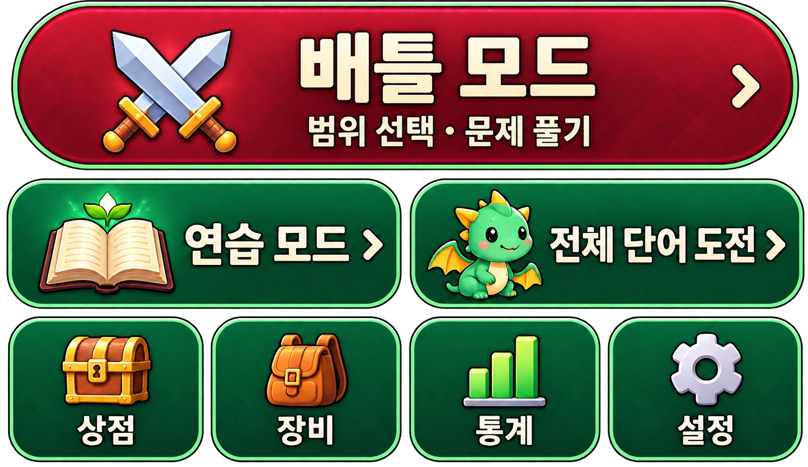

# 현행 디자인과 생성 이미지

이 문서와 [사용자 요구사항](user-requirements.md)이 현재 기준이다.
초기 남색/금색 테마와 제작 프롬프트는 [초기 프롬프트](archive/early-design-prompts.md),
단계별 변경은 [디자인 이력](archive/design-history.md)에 보존했다. 과거 파일 수·적용 설명을 현재 상태로 해석하지 않는다.

## 승인 시안

| 파일                                              | 용도                                                            |
| ------------------------------------------------- | --------------------------------------------------------------- |
| [시작 메뉴](design/approved-lobby.webp)           | 초기 7개 메뉴 버튼의 그림체 기준; 위쪽은 스토리·1일 전투로 분리 |
| [내부 메뉴](design/approved-menus.webp)           | 상점·장비·통계·설정의 생성 초안; 재질과 톤의 기준               |
| [초기 길드](design/guild-lobby-concept.webp)      | 초기 제작 이력; 연습 우선 배치는 현행이 아님                    |
| [내부 메뉴 탐색](design/quest-menu-concepts.webp) | 이전 탐색 시안                                                  |
| [스토리 지도 초안](design/story-map-draft.webp)   | 갈림길과 암시장을 배치한 생성 시안; 런타임 지도 배경으로 적용   |

내부 메뉴 시안의 숫자·가격·슬롯·뒤로 버튼은 예시다. 실제 값과 슬롯은 [현행 사양](spec.md)을 따르며 중복 뒤로 버튼은 제거되어 있다.

## 런타임 부품

| 위치/파일 패턴                                                        | 실제 사용                                                                  |
| --------------------------------------------------------------------- | -------------------------------------------------------------------------- |
| `images/theme/quest-lobby-{forest,sunset,moonlight}.webp`             | 랜덤 로비 배경; 차분한 숲·남자아이                                         |
| `images/theme/guild-titles.webp`                                      | 6가지 생성 로고의 2×3 atlas                                                |
| `images/theme/parts/menu-*.webp`                                      | 연습/도전/상점/장비/통계/설정 버튼과 스토리·1일 전투의 독립 생성 아이콘    |
| `images/theme/parts/game-*.webp`                                      | 현행 실행·위험·마을·답안·상단 컨트롤, 음악 ON/OFF                          |
| `images/theme/parts/approved-*.webp`                                  | 내부 메뉴 프레임·양피지·입력·슬롯·코인·집·남자아이 등                      |
| `images/theme/parts/calm-*.webp`                                      | 보조 바탕과 적용/출력/초기화/공격 아이콘                                   |
| `images/theme/parts/ui-*.webp`, `item-*.webp`                         | 메뉴·상점·장비·스킬별 투명 아이콘                                          |
| `images/theme/parts/monster-*.webp`                                   | 슬라임·고블린·박쥐·드래곤                                                  |
| `images/theme/parts/combat-{basic,fire,ice,lightning,void,gold}.webp` | 독립된 투명 공격 효과 6개                                                  |
| `images/theme/skyfall-field.webp`                                     | 단어 낙하전의 탑뷰 숲 공터 생성 배경                                       |
| `images/theme/story-map.webp`                                         | 생성 지도 배경; 전투·암시장 선택은 위치를 맞춘 HTML 버튼                   |
| `images/battle/`                                                      | 기존 모험가와 기존 모드의 몬스터 스프라이트                                |
| `images/theme/`의 기타 참조 에셋                                      | 기본/테마 CSS가 사용하는 장소·스킨·atlas; 참조를 검토하기 전 삭제하지 않음 |

`game-*`가 최종 버튼 재질을 제공하고 기존 `surface-*`는 공통 이미지 컴포넌트의 기본 재질이다.
발음은 브라우저 영어 TTS를 우선 사용하고 실패 시 원격 TTS로 전환한다. 단어별 발음 파일은 배포하지 않는다.
동일 역할처럼 보이는 파일도 CSS cascade에 실제 참조가 남아 있으면 미사용으로 단정하지 않는다.
현재 구조에서는 모든 런타임 이미지가 build에 복사되므로 참조 없는 파일은 검토 후 제거한다.

시작 화면의 모드·상점·장비·통계·설정은 생성 이미지 바탕·투명 아이콘과 HTML 글자를 분리해 작은 화면에서도 문구가 선명하며 아이콘만 별도로 축소할 수 있다. 모드 버튼은 `game-action.webp`(1일 전투는 `game-danger.webp`), 하단 메뉴는 `game-control.webp`를 사용한다. 이전 글자가 포함된 `menu-practice.webp`, `menu-boss.webp`, 하단 `menu-*.webp`는 로비에 표시하지 않는다.
게임 문제·정답·금액·수량·통계·설정은 HTML 텍스트/컨트롤이다. 그림 속 예시 값을 데이터로 옮기지 않는다.
아이콘과 텍스트는 별도 요소로 배치하고 버튼 바탕/메뉴 프레임은 nine-slice로 모서리를 보존한다.
전체 메뉴 통이미지와 좌표 기반 클릭 영역은 런타임에 사용하지 않는다.

## 이미지 제작 기준

새로운 그림이 필요하면 내장 image generation 도구로 승인 시안을 참조해 필요한 부품을 만든다.
초록 재질·크림색 테두리·만화풍·부드러운 음영·명확한 실루엣을 유지한다.
배경은 조용하게, 캐릭터는 남자아이로, 투명 아이콘/효과는 실제 알파 채널로 요청한다.
버튼/패널 바탕에는 문자·가짜 수치·아이콘을 넣지 않고 가운데를 비워 HTML이 표시될 공간을 둔다.
아이콘은 버튼과 별도로 만들고 작은 표시 크기에서 읽히도록 세부 장식을 줄인다.

최적화는 추출·비율 유지 축소·WebP 인코딩만 한다. 기존 부품은 대체로 바탕 최대 512px,
아이콘 128~224px, 캐릭터/공격 효과 최대 384px다. 대체로 quality 92~93/method 6이며 메뉴 버튼은 lossless 추출이다.
파일마다 기존 해상도·알파·화면 표시 크기를 확인하고 같은 설정을 기계적으로 강제하지 않는다.
공격 효과 6개의 합계는 약 317KB다. 새 VFX는 이동/입자 없는 reduced motion 표현도 제공한다.

최근 효과의 제작 방향: 투명 배경 3×2 atlas, 각 칸 안에 은빛 베기·화염·서리·번개·우주 소용돌이·금빛 공격을 독립 배치.
기존 만화풍과 톤을 맞추고 텍스트/배경/캐릭터 없이 효과만 그린 다음 각각의 WebP로 분리했다.
무기 형태에 따른 이동은 CSS가, 색과 모양은 효과 이미지가 담당한다.

## 원본 보존과 정리

기존 생성 PNG는 현재 작업 환경의 `/workspace/generated_images/`에 있으며 모든 원본이 Git에 들어 있는 것은 아니다.
나중에 새 환경에서 그 경로가 없어도 위 Git 추적 WebP와 승인 시안으로 작업할 수 있어야 한다.
원본 파일명·과거 프롬프트는 archive에서 참고한다. 런타임 WebP나 승인 시안이 기준이며 외부 임시 경로에 의존하지 않는다.

이번 정리에서 참조 없는 `guild-lobby.webp`와 이전 버튼/아이콘 10개를 삭제하고,
`quest-menu-complete.webp`는 `docs/design/approved-lobby.webp`로 옮겼다. 과거 원본은 Git 이력으로도 복구할 수 있다.
시안·PNG·검증 스크린샷은 배포용 images 폴더에 넣지 않는다. 변경 후 에셋 검사·빌드·실제 브라우저 확인이 필요하다.
